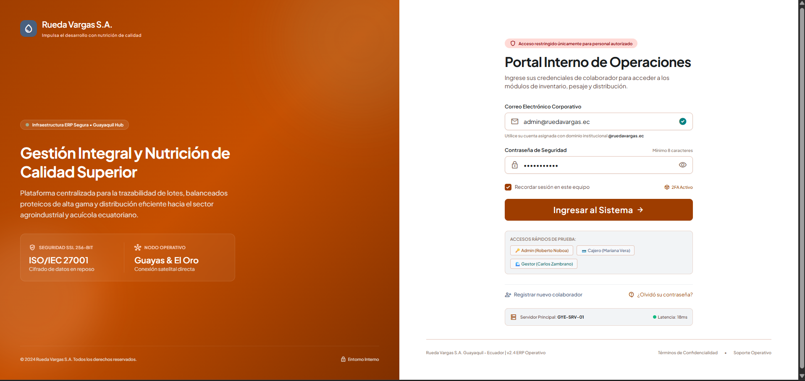
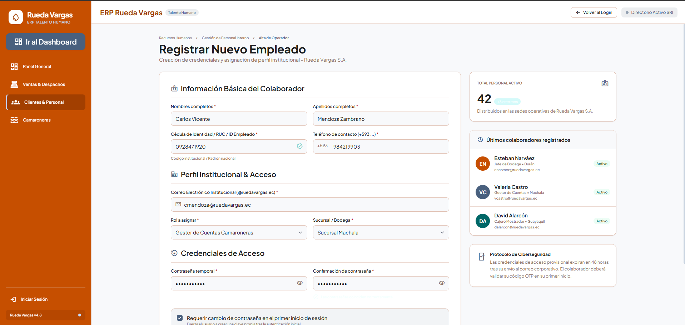
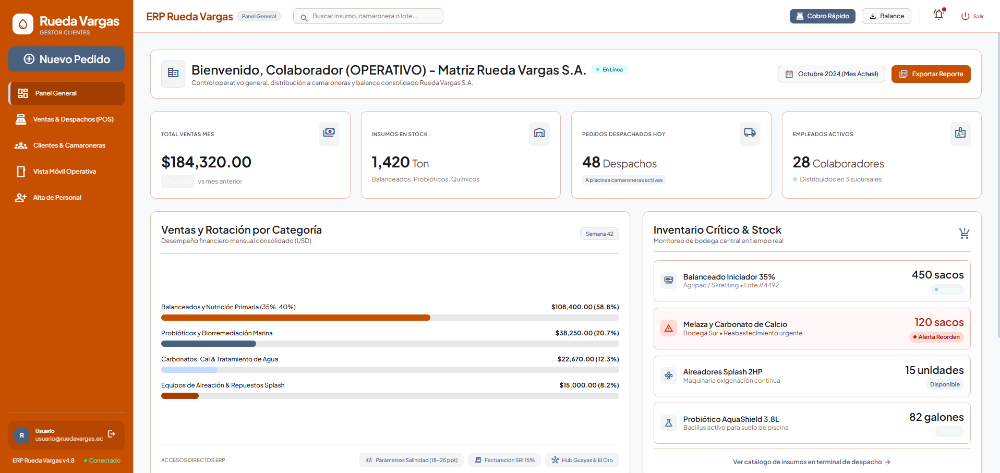
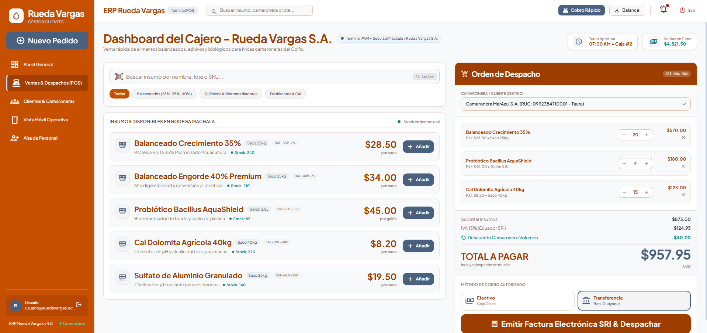
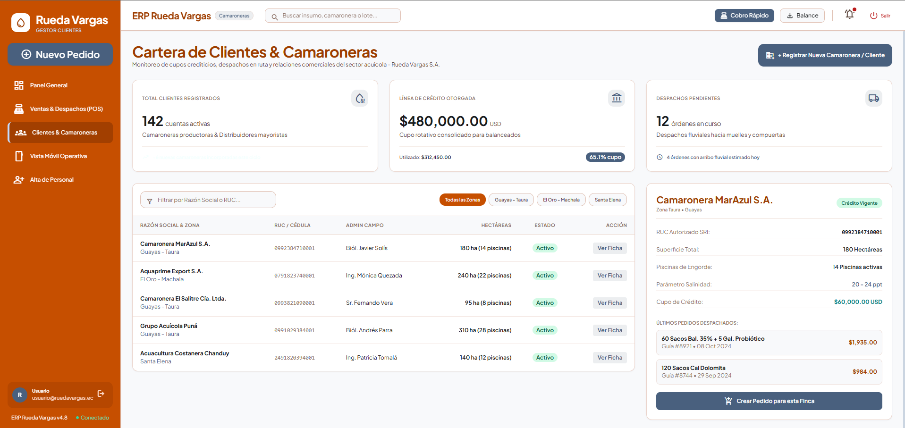
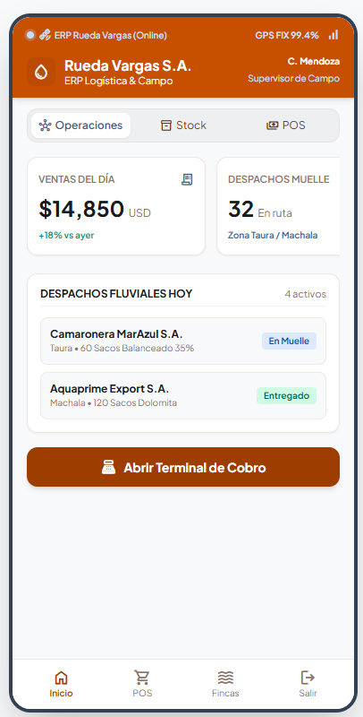

# Rueda Vargas S.A. — ERP Operativo & API REST de Insumos Acuícolas

Sistema de gestión interna y API RESTful para **Rueda Vargas S.A.** (empresa ecuatoriana especializada en nutrición, probióticos e insumos para el sector camaronero y acuícola), desarrollado con **Java 17** y **Spring Boot 3**. 

Implementa autenticación con **JWT**, control de acceso por roles (**Administrador**, **Cajero / Ventas**, **Gestor de Clientes** y **Cliente**) y persistencia con **Spring Data JPA**. Incluye un **frontend web operativo multi-rol** (login, registro de colaboradores, dashboard administrativo con directorio de camaroneras, punto de emisión con IVA 15% SRI y vista móvil de 390px) diseñado en **Google Stitch** y servido directamente por Spring Boot.

---

## 📸 Capturas de la interfaz y Endpoints

Las capturas corresponden a la aplicación en ejecución local (`http://localhost:3000`), con datos sincronizados con el backend:

### Inicio de sesión corporativo
Acceso con botones de prueba rápida para roles de Administración, Caja y Gestión de Campo.


### Registro de colaboradores y clientes
Formulario con selector de roles (`ADMIN`, `CAJERO`, `GESTOR_CLIENTES`, `CLIENTE`), validación de cédula/ID de empleado y prefijo ecuatoriano (+593).


### Dashboard — Administrador
Mando central con KPI operativos (despachos de balanceado, inventario de larvicultura, ventas del día y acceso a `GET /api/auth/admin-only`).


### Dashboard — Punto de Emisión y Caja (Cajero)
Punto de facturación con cálculo de IVA al 15% (normativa SRI Ecuador) y validación de `GET /api/auth/cashier-area`.


### Dashboard — Directorio de Camaroneras y Clientes
Gestión de fincas y camaroneras de la cuenca del Golfo y Manabí.


### Vista móvil operativa (390 px)
Diseño responsive adaptado para supervisores técnicos en campo.
<p align="center">
  
</p>

---

## 📡 Explorador y Pruebas de la API

El sistema cuenta con un explorador interactivo accesible en **[`http://localhost:3000/api`](http://localhost:3000/api)** que presenta cada endpoint en el formato exacto de las capturas de auditoría:

| Endpoint | Método | Acceso | Descripción |
| :--- | :---: | :--- | :--- |
| `/health` | GET | Público | Verificación de estado del servidor |
| `/api/auth/register` | POST | Público | Registro de empleados y clientes |
| `/api/auth/login` | POST | Público | Inicio de sesión, devuelve token JWT |
| `/api/auth/profile` | GET | Autenticado | Perfil de usuario autenticado |
| `/api/auth/cashier-area` | GET | `CAJERO`, `ADMIN`, `GESTOR_CLIENTES` | Despacho de insumos y área técnica |
| `/api/auth/admin-only` | GET | `ADMIN` | Área exclusiva de alta dirección |

### Manejo de errores documentados
- **400 Bad Request:** Validación de campos (contraseña sin mayúscula, email duplicado).
- **401 Unauthorized:** Intento de acceso a endpoints protegidos sin cabecera `Authorization: Bearer <token>`.
- **403 Forbidden:** Intento de acceso a un área restringida con un rol sin privilegios.

---

## 🧰 Tecnologías

| Capa | Tecnología |
| :--- | :--- |
| **Lenguaje** | Java 17 (LTS) |
| **Framework** | Spring Boot 3.2.5 (Web, Data JPA, Security, Validation) |
| **Seguridad** | Spring Security 6 + JWT (`io.jsonwebtoken` JJWT 0.12.5), BCrypt |
| **Persistencia** | Spring Data JPA / Hibernate |
| **Bases de Datos** | H2 en memoria (por defecto), PostgreSQL 15 (Docker) |
| **Frontend** | HTML5 semántico + ES Modules (JavaScript nativo) + Tailwind CSS |
| **Diseño** | Google Stitch (Exportación: Camarón ERP Insumos - Rueda Vargas S.A.) |
| **Tipografía** | Plus Jakarta Sans, Inter, Material Symbols Outlined |

---

## 🔐 Roles y Credenciales de Demostración

| Rol | Email | Contraseña | ID Empleado | Cargo |
| :--- | :--- | :--- | :--- | :--- |
| **ADMIN** | `admin@ruedavargas.ec` | `Password123` | `RV-001` | Ing. Roberto Noboa (Gerente General) |
| **CAJERO** | `cajero@ruedavargas.ec` | `Password123` | `RV-002` | Mariana Vera Alava (Jefe de Despacho) |
| **GESTOR_CLIENTES** | `gestor@ruedavargas.ec` | `Password123` | `RV-003` | Biólogo Carlos Zambrano (Asesor Técnico) |

---

## 🚀 Puesta en Marcha Local

### Requisitos
- **Java 17 o superior.**
- Conexión a internet para recursos CDN (Tailwind y Google Fonts).

### Pasos

1. Abre una terminal en la raíz del proyecto.
2. Inicia la aplicación Spring Boot:

```powershell
# Windows
.\mvnw.cmd spring-boot:run

# Linux / macOS
./mvnw spring-boot:run
```

3. Abre el navegador en las siguientes rutas:

| Módulo | URL |
| :--- | :--- |
| **Login Corporativo** | [http://localhost:3000/login.html](http://localhost:3000/login.html) |
| **Dashboard Operativo** | [http://localhost:3000/dashboard.html](http://localhost:3000/dashboard.html) |
| **Explorador de Endpoints** | [http://localhost:3000/api](http://localhost:3000/api) |
| **Health Check** | [http://localhost:3000/health](http://localhost:3000/health) |
| **Consola H2** | [http://localhost:3000/h2-console](http://localhost:3000/h2-console) (`jdbc:h2:mem:aquainsumos_db`) |

### Ejecución de Pruebas Automatizadas

```powershell
# Pruebas unitarias de Spring Boot
.\mvnw.cmd test

# Suite de pruebas de endpoints
powershell -ExecutionPolicy Bypass -File .\run_all_tests.ps1
```

---

## 🐳 Despliegue con Docker Compose (PostgreSQL)

Para ejecutar la API conectada a PostgreSQL 15 en contenedores Docker:

```bash
docker compose up --build
```

Para detener los servicios:

```bash
docker compose down
```
